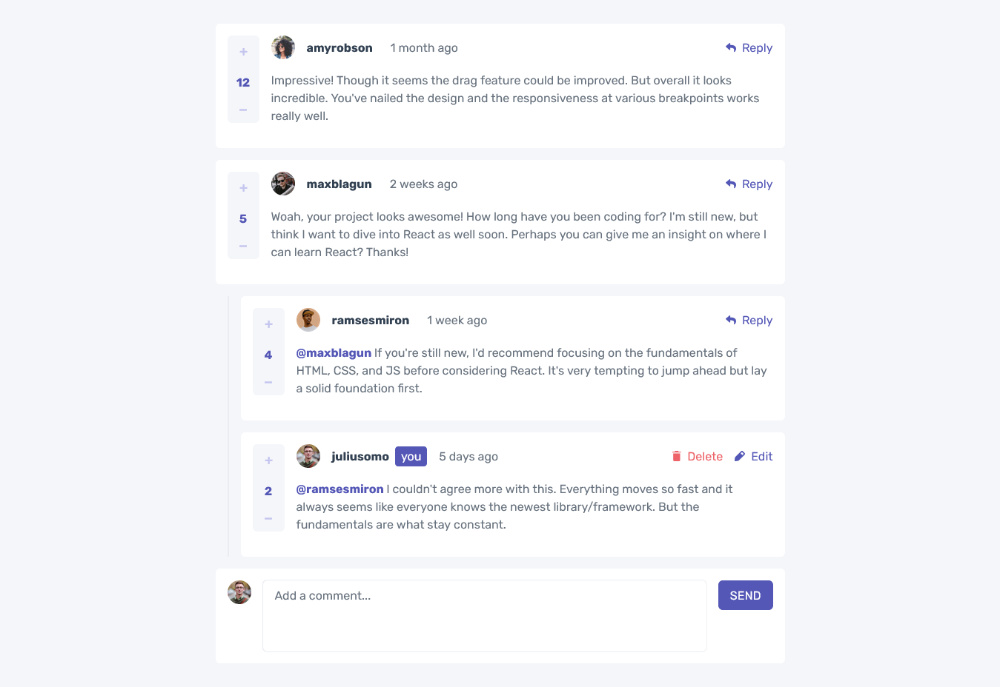

# Frontend Mentor - Interactive comments section solution

This is a solution to the [Interactive comments section challenge on Frontend Mentor](https://www.frontendmentor.io/challenges/interactive-comments-section-iG1RugEG9). Frontend Mentor challenges help you improve your coding skills by building realistic projects.

## Table of contents

- [Overview](#overview)
  - [The challenge](#the-challenge)
  - [Screenshot](#screenshot)
  - [Links](#links)
- [My process](#my-process)
  - [Built with](#built-with)
  - [What I learned](#what-i-learned)
  - [Useful resources](#useful-resources)
- [Author](#author)

## Overview

### The challenge

Users should be able to:

- View the optimal layout for the app depending on their device's screen size
- See hover states for all interactive elements on the page
- Create, Read, Update, and Delete comments and replies
- Upvote and downvote comments
- **Bonus**: If you're building a purely front-end project, use `localStorage` to save the current state in the browser that persists when the browser is refreshed.
- **Bonus**: Instead of using the `createdAt` strings from the `data.json` file, try using timestamps and dynamically track the time since the comment or reply was posted.

### Screenshot

### Links

- Solution URL: [Add solution URL here](https://your-solution-url.com)
- Live Site URL: [Add live site URL here](https://your-live-site-url.com)

## My process

### Built with

- Mobile-first workflow
- [React](https://reactjs.org/) – JS library for building UI
- [Tailwind CSS](https://tailwindcss.com) – CSS Framework for styling
- [Vitest](https://vitest.dev/) – unit & integration testing
- [React Testing Library](https://testing-library.com/docs/react-testing-library/intro/) – accessible testing utilities

### What I learned

- Implementing reducers to add, edit, and delete comments and replies safely (e.g. removing a reply by `id` without breaking the comment structure).
- Building a voting feature that correctly:
  - Increments score when the upvote button is clicked.
  - Neutralizes the score when the same vote button is clicked twice.
  - Switches smoothly between upvote and downvote, updating the score accordingly.
  - Decrements score when the downvote button is clicked.
- Using `Intl.RelativeTimeFormat` to show human-friendly relative times instead of static strings.
- Deepening my understanding of testing:
  - Learned how to differentiate between **unit tests** and **integration tests**.
  - Learned how to decide what should be tested.
  - Focused on testing the **behavior** and **outcomes** that matter to the user rather than implementation details.
  - Avoided writing unnecessary tests, which keeps the test suite faster and easier to maintain.

### Useful resources

- [React Testing Library Docs](https://testing-library.com/docs/react-testing-library/intro/) – Helped me understand how to write user-focused tests.
- [Vitest Docs](https://vitest.dev/) – Official reference for setting up testing.
- [MDN Intl.RelativeTimeFormat](https://developer.mozilla.org/docs/Web/JavaScript/Reference/Global_Objects/Intl/RelativeTimeFormat) – Guide for relative time formatting in JavaScript.

## Author

- Website - [Muhammad Alfi Zain](https://muhammad-alfi-zain.vercel.app/)
- Frontend Mentor - [@AlfiZain](https://www.frontendmentor.io/profile/AlfiZain)
